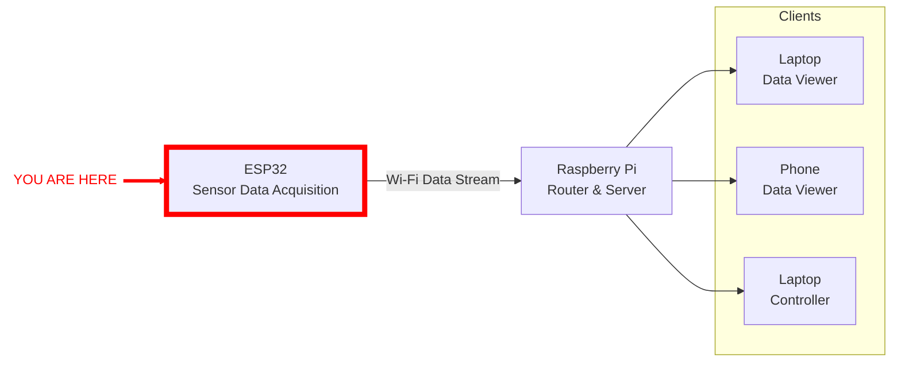

# prop-esp32-logger

This project contains all the control code for the QRET propulsion sub team's static hot fire setup.

## IDE Setup

This project is intended to be opened in VSCode and runs in windows. When you first open the project, install all of the recommended extensions that pop up in the bottom right.

## Environment Setup

To run this project you should be running Python3.11.x, with an isolated virtual environment. See [python
docs](https://docs.python.org/3/library/venv.html) for help setting up a virtual environment. Name yours something like
"qret", or "qret-prop"; something that is easily recognizable as the environment for this project.

To install all the required packages to work as a developer on this code, run: `pip install -e .`, or if you are
running uv (which I highly recommend), `uv pip install -e .`, in the ./prop-teststand directory. This installs the
listed requirements in the pyproject.toml file.

## System Architecture

The ESP-Data-Logger is the data collection unit for the whole system. Interfacing with ADS1112C04 16bit ADCs, these
devices are what gather the data on the performance of the test stand, as well as trigger various controls across the
propulsion interface. All data read by the ESP32s is streamed over WiFi to a Raspberry Pi hosting a server from which
the data is disseminated to any client processes.



## ESP32 Setup

### Our Hardware Specifications

The exact boards in use for the data loggers are ESP32-S3 boards with the N16R8 chip on them. They are listed as
ESP32-S3-DevKitC1s (a specific dev kit made by Espressif), but we are using clones of these off of
[amazon](https://www.amazon.ca/SANXIXING-Development-Module-Internet-ESP32-S3-DevKitC-1/dp/B0D9W4Y3F3?crid=RNR0KQUWLIRY&dib=eyJ2IjoiMSJ9.L3N0fctYqS3MoEGZwm_e5-yvLgmx9oru7I8WMspaK0n0p2E1U9Af3EI9D8wmpKylLkwaMf0RfzgCFrfuAPfCkakd8BhziLWNae4wJ58cff2QtFSa2hJhyVbh8ZXHLvMcZ0YQJ_KLo2G8Eu_aKBSFRA71hgue_ahoAOW6QdFHVM1G-G6kDE3dRi1jDScdHnm6Jfri_LmO90oBHaFGrnG158DEhYZ71GR3_e49bWbM0UK_pBE5eG2-45Z-AEnn04hdQLloIcG877aqJE-xmycsbe2CIZtyAaYzJghXrvTMgz0.FpW2y_2goffZthFJOV6yF2RooqFmVjpo9pGW7LPxPGc&dib_tag=se&keywords=esp32s3&qid=1732301035&sprefix=esp32%2Caps%2C105&sr=8-5>).
The N16R8 chip has 16MB of flash and 8MB of Pseudo Static RAM (PSRAM) with the ram configured as Octal SPI RAM (OSRAM)
allowing higher data transfer rates then other SPI formats (QSPI, or SPI).

As far as I know and have seen, these boards follow the same pinout as the Devkit-C1 boards, so any generic pinout
reference will work, like the one below.


### Installing Micropython on an ESP32

This project runs in micropython which is a version of python that is built to be ran on little microcontrollers like the
esp32. This has a bunch of benefits, namely that it is much more developer friendly to work in and we stay in a (roughly)
contained environment due to the backend code being written in python.

#### Installation Steps:

I generally will make a separate python environment to deal with firmware flashing like this and I'll name it something
like "esptools" just so that I am keeping device flashing/firmware level tools separate from the software work I am
doing. See the [python docs](https://docs.python.org/3/library/venv.html) for how to do this if you don't know.

1. Download the generic ESP32S3 Octal SPIRAM binary file (.bin) from the [official micropython
   site](https://micropython.org/download/ESP32_GENERIC_S3/) for the ESP32. As of writing this, the most recent version
   is ESP32_GENERIC_S3-SPIRAM_OCT-20241025-v1.24.0.bin

2. This generic build only has flash size configured for 8MB. Since we are using a chip with 16MB flash and want access
   to all of it, we need to update the build. To do this, we will use the **mp-image-tool-esp32** python library. This
   can be installed with (install with: `pip install mp-image-tool-esp32`) and run the following command from the directory with the micropython binary:

   ```mp-image-tool-esp32 .\ESP32_GENERIC_S3-SPIRAM_OCT-20241025-v1.24.0.bin -f 16M --resize vfs=0```

   This will re-configure the micropython build to accept 16MB of flash and resize vfs to account for our chip

3. Install the **esptool** python library (install with: `pip install esptool`) which will let us flash firmware to the
   ESP32.

4. Plug in your ESP32 and put the board into boot mode by pressing and holding the boot button (button closest to USBC
   ports) and pressing the reset button (button closest to actual chip -- the big metal heat spreader) once at the same time.

5. Check the port the device connected to. It will appear as a "USB serial device" in the windows device manager. Next, run
   the command "`esptool --port COMXX erase_flash`" from within your activated python environment with **esptool**
   installed. COMXX in this case is something like COM3, to clear out whatever is currently in flash.

6. Run the command:

   ```esptool --chip esp32s3 --port COMXX write_flash -z 0 . FILEPATH.bin```

   Where again COMXX is the COM port the device is connected to and FILEPATH is the path to the micropython image with
   the updated flash memory from step 2. The ```-z``` option tells the command to not try and detect the flash chip as we've
   already specified the size and the ```0``` parameter tells the script to start writing at the 0x0000 memory address
   (right at the start, as specified in [the official ESP32s3 micropython setup documentation](https://micropython.org/download/ESP32_GENERIC_S3/))

7. **IMPORTANT:** Press the reset button on the board (button closest to the big metal heat spreader on our boards) to
   pull the board out of boot mode and into its normal operation mode. When you do this, the COM port the device is
   assigned to will most likely change (e.g. COM3 for the memory flashing and COM4 in normal operation), which is a good
   indicator that you did something right.

#### Checking install correctly

1. In the REPL ([what is a REPL???](https://realpython.com/python-repl/)) for the ESP32, which you can get to by simply
   running `mpremote` (see below, and assuming you didn't mess up), run `import esp` then `esp.flash_size()`. You should
   see something around 16777216 as the return value. This means you installed the correct 16MB flash image.

### Working with micropython

The best tool to work with micropython that I've found is `mpremote`. This library is one of the developer requirements for this project and should be installed correctly if you followed through the environment setup above.

Some useful micropython commands:

| Command | Description |
| ------- | ----------- |
| ```mpremote``` | Connects to first available serial device and opens REPL by default. Equivalent to "mpremote |
| ```mpremote connect port:COMXX``` | Connects to serial device on specified com port. Shorthand is "mpremote cXX |
| ```mpremote run <file.py>``` | Runs a script from **your computer's filesystem**. Prints any output to outside terminal. |
| ```mpremote fs``` | Prefix to give access to filesystem management commands |
| ```mpremote fs ls``` | Lists files currently in the root directory of the microcontroller |
| ```mpremote fs cp <localFile> :``` | Copies local file into the root directory of the microcontroller |

The full documentation on using mpremote can be found
[here](https://docs.micropython.org/en/latest/reference/mpremote.html)

I've added a batch script that can be ran from the command line and automatically uses mpremote to copy all the relevant
project files into the ESP32. See [writeAndReset.bat](/writeAndReset.bat).
